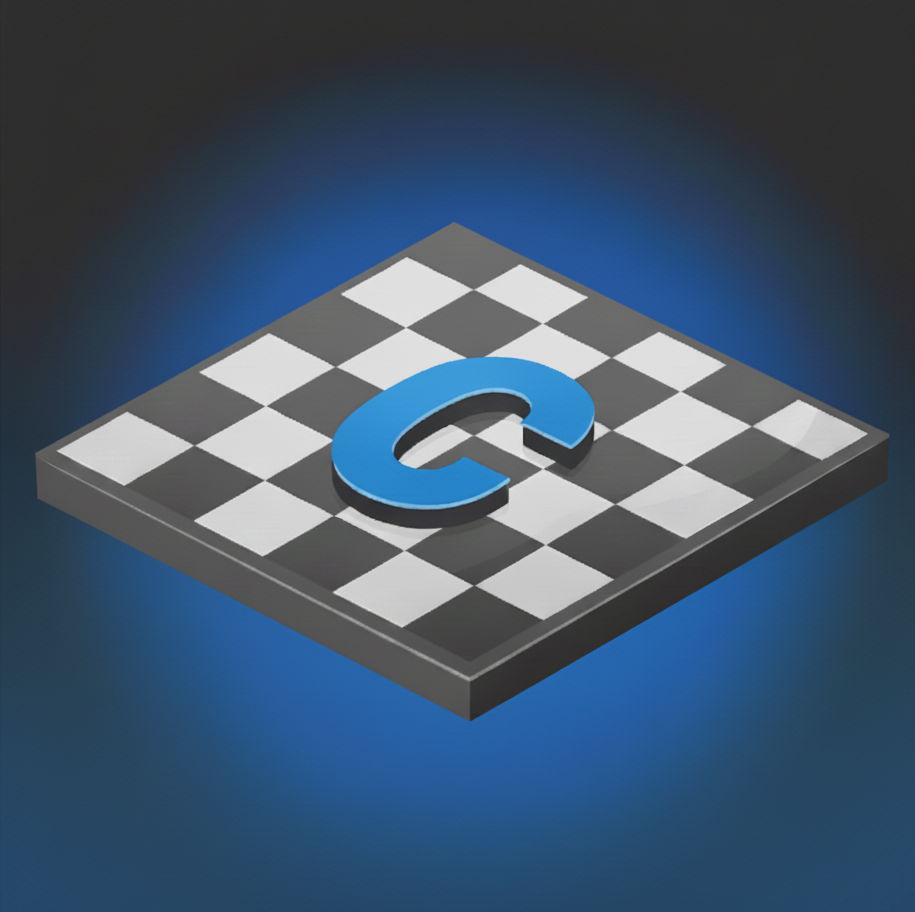
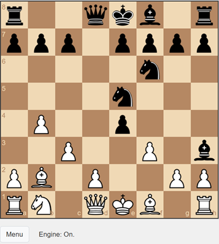
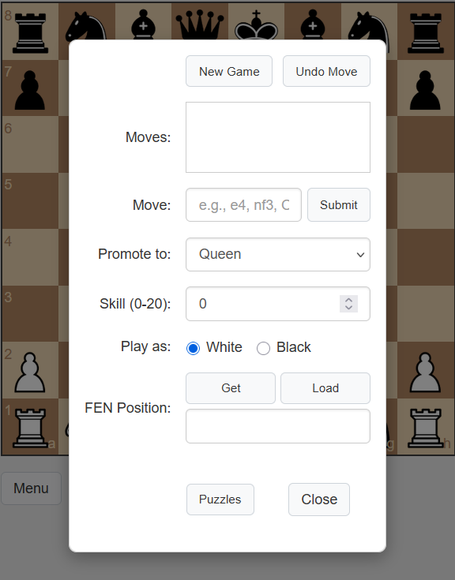
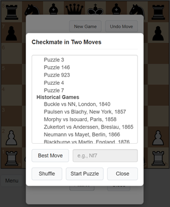
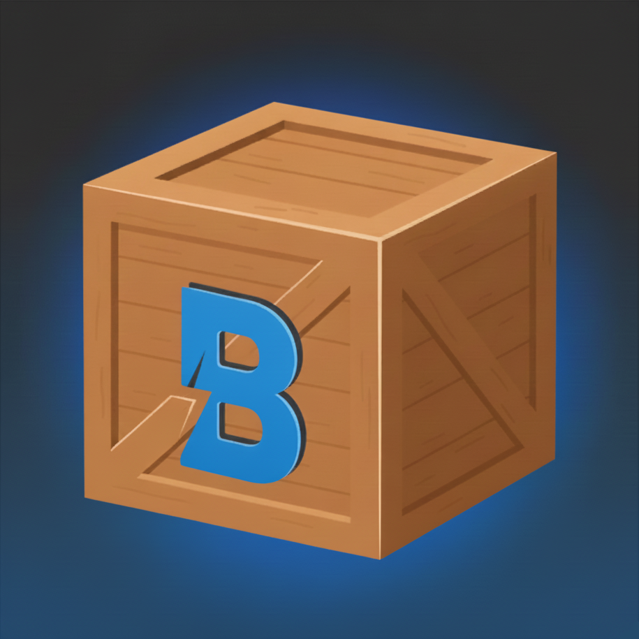
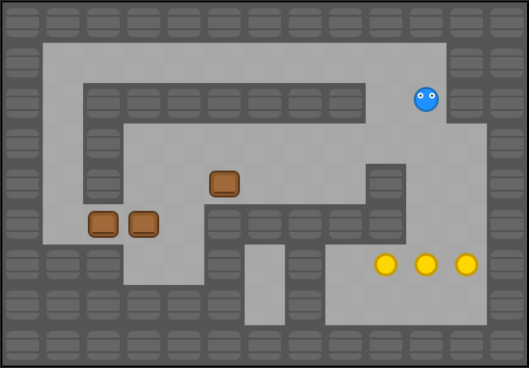

# Open Source Games for Reinforcement Learning

This repository contains a collection of open-source games designed for use in reinforcement learning (RL) research and development. The games provide diverse environments for training and testing AI agents, with a focus on strategic thinking, puzzle-solving, and tactical gameplay.

## Games

### Chess



Chess is a classic game powered by the Stockfish chess engine, offering a range of skill levels for players to challenge themselves against an AI opponent. The game features a simple, intuitive interface with options to customize gameplay, track the state of the game board, and a selection of endgame chess puzzles for testing tactical skills.

The primary objective is to outmaneuver the AI and achieve checkmate. The game's challenge is provided by Stockfish v11. The user interface includes features such as drag-and-drop piece movement, undoing previous moves, and starting new games at various skill levels. For advanced users, there is an option to load and save the game state in FEN (Forsyth-Edwards Notation) format, which can be accessed by copying and pasting text. The current match is also stored in the browser's local storage, allowing one to resume a game at a later time.

#### Platform

This web browser version of Chess supports both desktop and mobile devices. On slower devices or at higher skill levels, the chess engine may take a few seconds to make a move, which may cause a brief delay in the user interface.

#### Puzzles

The puzzles in Chess is a challenge to deliver checkmate in two moves. First, find the key move that initiates the checkmating sequence, and the AI will respond with its best possible defense. Then deliver the final checkmating move. This is a classic exercise designed to sharpen one's tactical vision. For a hint, a "best move" option is available in the puzzles section.

Chess v1 includes both historical and computationally curated puzzle sets. The curated set of 1,180 puzzles was derived from a collection of 329,951 chess positions from the Lichess database, filtered for "mateIn2" themes and validated against the Stockfish v17 engine. A shuffle option is available to randomize a selection of 50 of these curated puzzles for shorter gaming sessions.

#### Data Sources

-   [https://www.wtharvey.com/m8n2.txt](https://www.wtharvey.com/m8n2.txt)
-   [https://database.lichess.org/#puzzles](https://database.lichess.org/#puzzles)

#### Screenshots





### Boxes



Boxes is a minimalist puzzle game that challenges players with logic and spatial reasoning. Inspired by the classic Sokoban genre, the objective is to solve carefully designed levels by pushing boxes to their designated goal locations. The game emphasizes thoughtful planning over quick reflexes.

#### Gameplay

The core objective in each level is to maneuver the player character to push every box onto a goal tile. A level is complete only when all boxes are situated on all goals. The primary challenge arises from the layout of the walls and the placement of the boxes. Players must think ahead to avoid pushing boxes into corners or against walls where they can no longer be moved. The game features collections of levels that progressively introduce more complex arrangements.

#### Controls

Boxes supports multiple control schemes to accommodate different platforms and player preferences.

-   **Keyboard**: For desktop play, movement is controlled with the Arrow Keys or the W, A, S, and D keys. Players can undo their most recent move by pressing U or Z. The current level can be reset at any time by pressing the R key.
-   **Touch and On-Screen Interface**: On touch-enabled devices, players can move by swiping in the desired direction. For more precise control, an on-screen D-pad can be toggled. The user interface also provides dedicated buttons to undo a move or reset the level.

#### Screenshot



## Installation

To run the games locally, simply clone this repository and open the `index.html` file for the desired game in a web browser. If a feature is missing, then it is likely necessary to serve the files from a web server instead.

```bash
git clone https://github.com/bob-friedman/ai-game-learning-rl.git
cd ai-game-learning-rl/chess  # or 'boxes'
# Either open index.html in a web browser or add files to an accessible directory on a web server
```

## License

This project is licensed under the GNU General Public License v3.0. See the [LICENSE](LICENSE) file for details.
