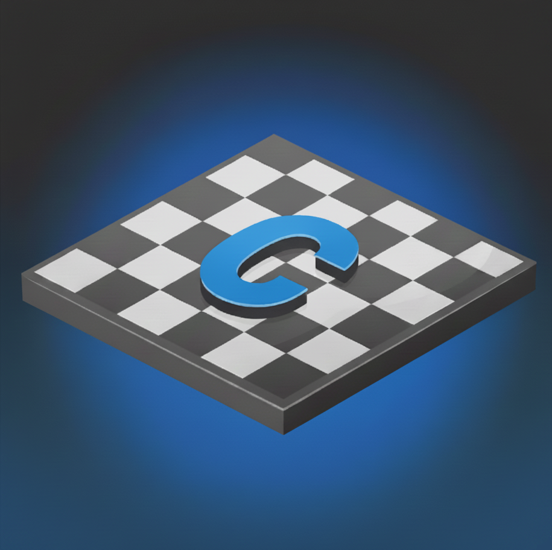
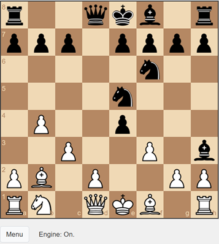
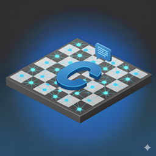
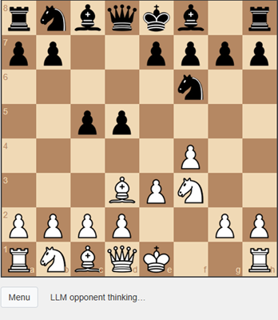
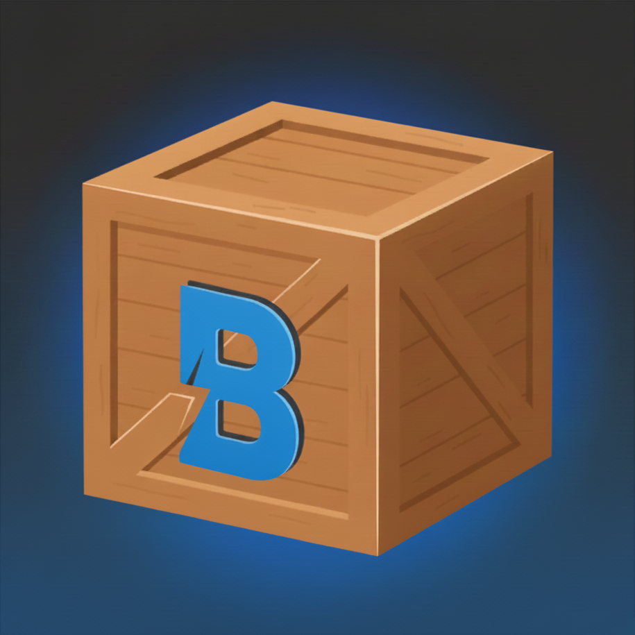
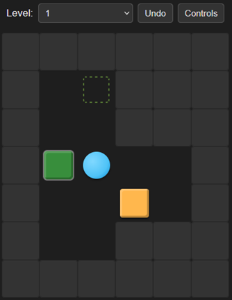
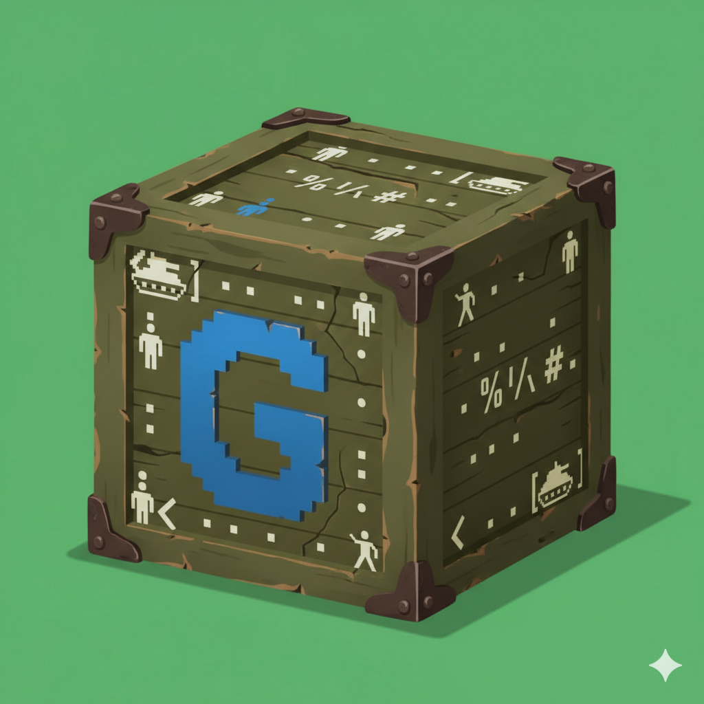
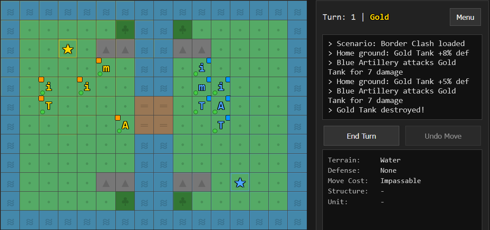
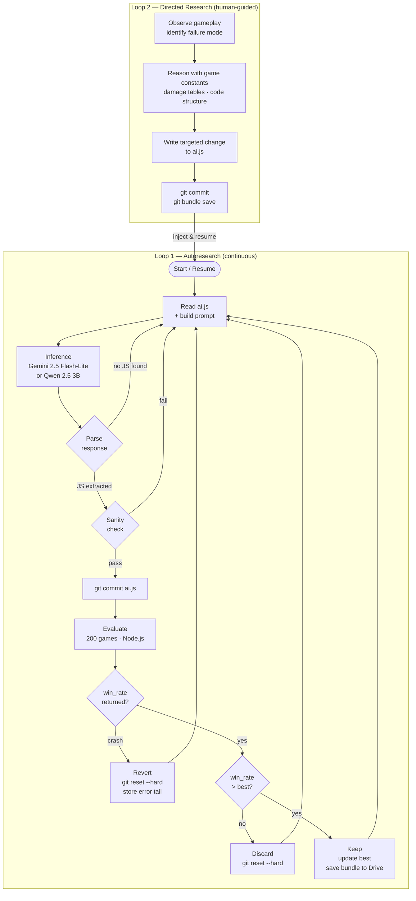

# Open Source Games for Reinforcement Learning

[](https://doi.org/10.5281/zenodo.17273372)

This repository has a collection of open-source games designed for use in reinforcement learning (RL) research and development. The games provide diverse environments for training and testing AI agents, with a focus on strategic thinking, puzzle-solving, and tactical gameplay. These features allow for adaptation for the generation of data that is used in training an AI model by the methods of reinforcement learning.
___
## Chess



Chess is a classic game, in this case supported by the Stockfish v11 chess engine, offering a range of skill levels for players as a challenge against an AI opponent. The game has a simple interface with options to customize gameplay, track the state of the game board, along with a selection of endgame chess puzzles for testing skills for tactical advantage.

The primary objective is to outmaneuver the AI and achieve checkmate. The user interface includes features such as drag-and-drop piece movement, undoing previous moves, and starting new games at various skill levels. For advanced users, there is an option to load and save the game state in FEN (Forsyth-Edwards Notation) format, which is accessible by a copy/paste of text operation. The current match is also stored in the browser's local storage, allowing for a resumption of a match at a later time.

### Platform

This web browser version of Chess supports both desktop and mobile devices. On slower devices or at higher skill levels, the chess engine may take a few seconds for a move, which may cause a brief delay in the availability of the user interface.

### Puzzles

The puzzles in Chess are for delivering checkmate in two moves. First, find the key move that initiates the checkmating sequence, and the AI will respond with its best possible defense. Then deliver the final checkmating move. This is a traditional exercise designed to sharpen one's tactical vision. For a hint, a *best move* option is available in the puzzles section.

Chess includes both historical and computationally curated puzzle sets. The curated set of 1,180 puzzles originated from a set of 329,951 chess positions as derived the Lichess database (theme: mateIn2), and depended on a validation step against the Stockfish v17 engine (see scripts/ in this archive).

### Sources of Data

-   [https://www.wtharvey.com/m8n2.txt](https://www.wtharvey.com/m8n2.txt)
-   [https://database.lichess.org/#puzzles](https://database.lichess.org/#puzzles)

### Screenshot


___
## Chess v1-LLM



Chess v1-LLM is an experimental version of the original Chess v1 application. While maintaining the core features of the Stockfish-powered engine, this version introduces the capability to play directly against Large Language Models (LLMs) through conformant API access.

### LLM Opponent

This feature allows for a more human-like and conversational gameplay experience compared to traditional chess engines. The application supports multiple LLM providers, including Anthropic, Google Gemini, and OpenAI-compatible endpoints.

Key features include:
- **Strategic Continuity**: The LLM receives a structured history of the game, including its own past commentary, allowing it to maintain strategic and stylistic consistency throughout the match.
- **Provider-Agnostic Integration**: A flexible configuration system supports various API formats and authentication methods.
- **Resilient Connectivity**: Built-in retry logic and a "paused" state handle network issues or API limits without losing game progress.
- **Detailed Logging**: A comprehensive export feature captures the full game log, including PGN, FEN, and the LLM's internal commentary for each move, which is valuable for reinforcement learning research and analysis.

> [!WARNING]
> Users should exercise caution when configuring LLM API keys. To prevent unauthorized access to your credentials, it is recommended to access the Chess v1-LLM application via `file:///` or serve to `localhost` only. Additionally, monitor your API usage as LLM queries may incur costs from your provider.

### Screenshot


___
## Boxes



Boxes is a minimalist puzzle game that challenges players with logic and spatial reasoning. Inspired by the classic Sokoban genre, the objective is to solve carefully designed levels by pushing boxes to their designated goal locations. The game emphasizes thoughtful planning over quick reflexes.

### Gameplay

The core objective in each level is to maneuver the player character to push every box onto a goal tile. A level is complete only when all boxes are situated on all goals. The primary challenge arises from the layout of the walls and the placement of the boxes. Players must think ahead to avoid pushing boxes into corners or against walls where they can no longer be moved. The game features collections of levels that progressively introduce more complex arrangements.

### Controls

Boxes supports multiple control schemes to accommodate different platforms and player preferences.

-   **Keyboard**: For desktop play, movement is controlled with the Arrow Keys or the W, A, S, and D keys. Players can undo their most recent move by pressing U or Z. The current level can be reset at any time by pressing the R key.
-   **Touch and On-Screen Interface**: On touch-enabled devices, players can move by swiping in the desired direction. For more precise control, an on-screen D-pad can be toggled. The user interface also provides dedicated buttons to undo a move or reset the level.

### Screenshot


___
## Grid Combat (Enhanced Edition v1.3)



This browser-based tactical strategy game pits two military factions—the Gold and Blue teams—against each other on grid-based battlefields filled with diverse terrain. Players command a variety of units including infantry, tanks, mechanized walkers, heavy armor, artillery, and rocket launchers, each possessing unique movement ranges, vision capabilities, and combat statistics that interact dynamically with environmental factors like woods, mountains, roads, and water obstacles. The gameplay emphasizes positional strategy and resource management, with units unable to move through certain terrain and defensive bonuses varying by location, while specialized infantry units serve as the only forces capable of capturing enemy headquarters to achieve victory.

### Recent Updates (v1.3)

-   **Advanced Strategic AI**: Implementation of a dynamic AI system featuring a desperation curve (increasing aggression when losing), conservation doctrine (preserving units during parity), and breach tactics (aggressive breakthroughs during advantage).
-   **Game Analytics & History**: A comprehensive history system that records turn-by-turn snapshots, calculates strategic balance, and generates a visual performance chart. Data can be exported as JSON for further analysis.
-   **AI vs AI Spectate Mode**: New game modes allow for automated matches between AI opponents, with adjustable speeds and pause functionality.
-   **Enhanced UI & Responsiveness**: A completely redesigned, mobile-friendly interface featuring a sliding menu system, better scaling for different screen sizes, and improved touch controls.
-   **Save/Load Functionality**: Support for saving game progress to local storage and resuming at a later time.
-   **Visual Enhancements**: Added floating combat text for damage and capture points, HP indicators (dots), and a home territory defense gradient.

The turn-based combat system features direct engagements where attackers exchange fire with defenders unless utilizing ranged artillery that can strike from a distance without retaliation. An AI opponent automatically maneuvers the enemy forces during their turn, seeking optimal paths toward capture points and engaging vulnerable targets. The game includes scenarios that present unique tactical puzzles, alongside partly randomized skirmish modes that create maps with natural chokepoints and strategic crossings. Visual feedback features color-coded team indicators, terrain characters, and highlighted movement ranges, while an information panel displays statistics about unit health, terrain defense modifiers, and capture progress.

The gameplay mechanics and combat units are inspired by Advance Wars and clones. The user interface is designed for a mouse and desktop monitor, but it has limited touchscreen support for tablets with a large display.

### Gameplay

Each turn, command your units in any order. Units have two fundamental states: move/attack and acted this turn. Plan carefully since there is no undo after combat resolves, although movement can be reversed if a particular unit has not engaged yet.

Combat Resolution:
1. Attacker strikes first with scaled damage (HP × base damage × terrain defense).
2. Defenders strike back if adjacent and not ranged themselves.
3. Units at 0 HP are removed from battlefield.

Ranged units (Artillery, Rocket) attack at distance without retaliation, but cannot move and fire in the same turn. Positioning them behind frontline units is essential.

### Units and Terrain

| Unit | HP | Move | Vision | Range | Capture | Description |
| :--- | :--- | :--- | :--- | :--- | :--- | :--- |
| **Infantry** | 10 | 3 | 2 | 1 | Yes | Basic unit. Can capture HQ. |
| **Tank** | 10 | 2 | 3 | 1 | No | Mobile armor. Road bonus essential. |
| **Mech** | 12 | 2 | 2 | 1 | Yes | Heavy infantry. Better defense than tanks. |
| **Heavy Tank** | 16 | 2 | 2 | 1 | No | Juggernaut. Slow but devastating. |
| **Artillery** | 8 | 2 | 5 | 3-4 | No | Long range. Cannot move and fire. |
| **Rocket** | 7 | 2 | 4 | 3-5 | No | Anti-armor specialist. Fragile. |

| Terrain | Defense | Move Cost | Description |
| :--- | :--- | :--- | :--- |
| **Plains** | 15% | 1 | Open ground. |
| **Woods** | 30% | 2 | Light cover. |
| **Mountain** | 60% | 3 | Heavy cover. |
| **Road** | 0% | 1 | Fast movement. |
| **Water** | - | Impassable | Impassable to ground units. |

### Damage Matrix (Base Damage)

| Attacker \ Defender | Infantry | Tank | Mech | Heavy | Artillery | Rocket |
| :--- | :---: | :---: | :---: | :---: | :---: | :---: |
| **Infantry** | 5 | 2 | 3 | 2 | 4 | 3 |
| **Tank** | 8 | 6 | 5 | 4 | 5 | 6 |
| **Mech** | 6 | 5 | 5 | 3 | 6 | 5 |
| **Heavy Tank** | 10 | 8 | 9 | 6 | 7 | 8 |
| **Artillery** | 9 | 8 | 8 | 6 | 5 | 7 |
| **Rocket** | 6 | 10 | 9 | 8 | 6 | 5 |

*Actual damage = Base × (Attacker HP / Max HP) × Terrain Defense.*

**Victory Condition: HQ Capture.**
HQs require 20 capture points to seize. Each turn, capturing units contribute points equal to their current HP (max 10). A full-health Infantry or Mech needs 2 turns to capture; wounded units take longer. Only Infantry and Mech can capture. If both sides lose their capturing units, then a stalemate occurs.

### Scenarios

**For Training**
- **Border Clash**: Vertical river, single central bridge. Warfare at bottleneck regions.
- **Siege**: Horizontal barrier with elevated HQs. Siegecraft and artillery positioning.
- **River Crossing**: Diagonal water with one contested bridge. Timing and commitment.
- **The Gauntlet**: Single narrow corridor. No flanking. Favors direct confrontation with enemy units.

**Advanced**
- **Border Clash - Advanced**: Enhanced forces with Rocket and Artillery support.
- **Siege - Advanced**: Heavy Tank breakthroughs and coordinated artillery fire.
- **River Crossing - Advanced**: Rocket ambushes at the bridgehead.
- **The Gauntlet - Advanced**: Full roster engagement in a lethal corridor.

**For Skirmishes**
- **Lake Crossing (16×14)**: Flanking routes, 11 units per side.
- **Mountain Frontier (20×16)**: Central mountain spine, a few approach vectors, 12 units per side.

Each skirmish is a core force (2 Infantry, 1 Mech, 2 Tanks) plus randomized support. You might face Artillery duels, Heavy Tank breakthroughs, or Rocket ambushes. These maps are generated based on basic templates of fixed geography for variability. Randomization affects woods/plains distribution but rivers, bridges, and mountains remain fixed for AI robustness. Also, in all scenarios the units can path through friendly forces but cannot end movement on occupied tiles.

### Screenshot



### Autoresearch — Autonomous AI Improvement

This section documents an autonomous research system developed for iterative improvement of the Grid Combat AI heuristic (`ai.js`). The architecture and procedure are based on the [autoresearch](https://github.com/karpathy/autoresearch) project by Andrej Karpathy. It is released as open scientific work for researchers aiming to automate the discovery of optimal game heuristics.

A closed loop runs on Google Colab, leveraging Gemini 2.5 Flash-Lite (via API) or a local Qwen 2.5 3B model (T4 GPU). The language model proposes modifications to `ai.js`; a Node.js evaluator measures win rate across 200 games; the harness commits, evaluates, and keeps or reverts each change without human intervention. All progress is persisted to Google Drive via a git bundle, surviving session expiry.

The system implements two complementary loops. Loop 1 runs autonomously and is suited to parameter tuning and simple heuristic additions. Loop 2 is human-guided and addresses targeted algorithmic changes — for example, correcting ranged unit positioning — that win rate alone cannot diagnose. A Loop 2 change is injected into `ai.js` manually, then Loop 1 resumes and fine-tunes within the expanded capability.


```mermaid
flowchart TD
    subgraph L1["Loop 1 — Autoresearch (continuous)"]
        A([Start / Resume]) --> B[Read ai.js<br/>+ build prompt]
        B --> C["Inference<br/>Gemini 2.5 Flash-Lite<br/>or Qwen 2.5 3B"]
        C --> D{Parse<br/>response}
        D -- "no JS found" --> B
        D -- "JS extracted" --> E{Sanity<br/>check}
        E -- fail --> B
        E -- pass --> F[git commit ai.js]
        F --> G["Evaluate<br/>200 games · Node.js"]
        G --> H{"win_rate<br/>returned?"}
        H -- crash --> I["Revert<br/>git reset --hard<br/>store error tail"]
        I --> B
        H -- yes --> J{"win_rate<br/>> best?"}
        J -- no --> K["Discard<br/>git reset --hard"]
        K --> B
        J -- yes --> L["Keep<br/>update best<br/>save bundle to Drive"]
        L --> B
    end

    subgraph L2["Loop 2 — Directed Research (human-guided)"]
        M["Observe gameplay<br/>identify failure mode"]
        M --> N["Reason with game constants<br/>damage tables · code structure"]
        N --> O["Write targeted change<br/>to ai.js"]
        O --> P[git commit<br/>git bundle save]
    end

    P -- "inject & resume" --> A
```

#### Empirical Results

| Metric | Value |
| :--- | :--- |
| Baseline win rate | 50.0% |
| Best achieved | 61.75% (Experiment #1) |
| Gain | +11.75 points |
| Evaluator | 200 games · 4 scenarios · noise ≈ 1.5 pts |
| Primary Model | Gemini 2.5 Flash-Lite (API) |
| Fallback Model | Qwen 2.5 3B · 4-bit NF4 (local) |
| Platform | Google Colab |

#### Findings

**Established.** The autoresearch loop functions correctly and reliably, especially when using Gemini 2.5 Flash-Lite. It handles inference, evaluation, and persistence without human intervention. Significant win rate improvements have been achieved, confirming the pipeline produces real results.

**Refining Local Constraints.** Earlier experiments with Qwen 2.5 3B demonstrated that while 3B-class models can achieve initial gains, they eventually hit a capacity ceiling in agentic use. The transition to Gemini 2.5 Flash-Lite successfully bypassed these limitations, allowing for sustained, autonomous exploration of the heuristic search space without the syntactic degradation often observed in smaller local models.

**Open question.** Whether the win rate gain translates to harder human play is untested and is the sole criterion of practical success for this project.

#### Future Direction

Future research will focus on human play testing to verify win rate gains, and implementing more complex spatial awareness heuristics for ranged units that the autoresearch loop can then parameterise.

#### Reproducing This System

Requirements: Google Colab account. Gemini API key (recommended) or T4 GPU runtime. The notebook `GridCombat_Autoresearch.ipynb` contains all cells, configuration, and documentation. Upload `ai.js`, `baseline_ai.js`, `game_core.js`, and `evaluate.js` to Colab, then run cells in order. The git bundle on Drive preserves all progress across sessions.
___
## Installation

To run the games locally, clone this repository and serve the directory chess/, boxes/, or grid-combat/ via a web server. This step will make the games available to a web browser. A local web server may be used: `python3 -m http.server`, which defaults to port 8000.

```bash
git clone https://github.com/bob-friedman/ai-game-learning-rl.git
```

These games may also run as files with limited or full functionality if the web browser has permission to access local files. Here is an example in Windows if they are installed in C:\GamesRL\: `file:///C:/GamesRL/boxes/index.html`.

## License

This project is licensed under the GNU General Public License v3.0. See the [LICENSE](LICENSE) file for details.

## Data Retrieval Entry Points

The games in this repository are designed to be transparent and accessible for AI research. The following sections detail the primary functions and variables that can be used to extract game state, history, and other relevant data for training reinforcement learning models.

### Chess

The core logic for the Chess game is located in `chess/game.js`. The `engineGame` object provides several methods to access game data:

-   **`game.fen()`**: Returns the Forsyth-Edwards Notation (FEN) string, which describes the current board state in a single line of text. This is ideal for capturing a snapshot of the board at any given moment.
-   **`game.pgn()`**: Returns the Portable Game Notation (PGN) string, which provides a complete record of the moves played in the current game. This is useful for analyzing entire game sequences.
-   **`get_moves()`**: This function returns a space-separated string of all moves made in the current game, which can be useful for move analysis.
-   **`localStorage.getItem('savedChessGame')`**: The game automatically saves the current state to the browser's local storage. This JSON object contains the FEN string, the player's color, and the AI's skill level, allowing for game resumption and data extraction.
-   **`loadPuzzle(fen)`**: This function allows you to load a specific board position using a FEN string, which is useful for setting up specific scenarios for an AI agent to solve.

### Chess v1-LLM

The `chess-v1-llm/game.js` includes additional methods specifically for LLM integration:

-   **`game.setLLMConfig(config)`**: Configures the LLM opponent with provider details, API keys, model selection, and system prompts.
-   **`game.isLLMEnabled()`**: Returns a boolean indicating whether the LLM opponent is currently active.
-   **`game.retryLLMMove()`**: Resumes a paused game by re-attempting the last LLM move request.
-   **`game.exportLLMLog()`**: Generates a detailed JSON log of the entire match, including the LLM's commentary and strategic context for every move.

### Boxes

The Boxes game logic is contained in `boxes/boxes.js`. The game state is managed through several key JavaScript variables:

-   **`board`**: A 2D array representing the static layout of the level, including walls and floor tiles.
-   **`player`**: An object containing the player's current `x` and `y` coordinates.
-   **`boxes`**: An array of objects, where each object represents a box and its `x` and `y` coordinates.
-   **`goals`**: An array of objects that stores the `x` and `y` coordinates of the goal locations.
-   **`undoStack`**: This array stores a history of previous game states. Each element in the stack is an object containing the player and box positions for a prior move, making it an excellent source for sequential training data.
-   **`parseSokobanLevels(text)`**: This function can be used to load custom level data in the Sokoban format, allowing for the creation of new and varied training environments.

### Grid Combat

The game logic for Grid Combat is contained in `grid-combat/game.js`. The following variables and functions can be used to extract game state and interact with the game:

-   **`map`**: A 2D array of objects representing the terrain layout. Each object contains the terrain type (`plain`, `wood`, `mountain`, `road`, `water`) and coordinates.
-   **`units`**: An array of unit objects currently on the battlefield. Each unit has properties like `type`, `team`, `x`, `y`, `hp`, `maxHp`, and status flags (`moved`, `hasAttacked`).
-   **`structures`**: An array of structure objects. Each structure (like `hq`) includes its `type`, `x`, `y`, `team`, and `captureLeft` (remaining points needed to capture).
-   **`turn`**: An integer (0 or 1) indicating which team's turn it is (0: Gold, 1: Blue).
-   **`actionHistory`**: An array of recent actions (moves and combat), useful for tracking the sequence of events in the current turn.
-   **`UNITS`, `TERRAIN`, `STRUCTURES`**: Constant objects defining the stats and properties of all units, terrain types, and structures in the game.
-   **`loadScenario(scenarioId)`**: Loads a specific scenario or skirmish by its ID.
-   **`endTurn()`**: Finalizes the current turn and switches to the other team.
-   **`undoMove()`**: Reverts the last move made in the current turn, if no combat has occurred.
-   **`getMovableTiles(unit)`**: Returns an array of coordinates where the given unit can move.
-   **`getAttackTargets(unit)`**: Returns an array of enemy units that the given unit can attack from its current position.
-   **`gameHistory`**: An array of objects representing snapshots of each turn, including material counts, strategic pressure, and net balance. This is the primary source of time-series data for training models.
-   **`evaluatePosition()`**: Function used to calculate the current strategic balance between teams.
-   **`exportHistoryJSON()`**: Generates and downloads a JSON file containing the full game history and associated metadata.

## Contributors

The development of the software and code benefited significantly from discussions and iterative refinement with AI language models. The author oversaw and reviewed the accuracy and robustness of all parts of its development.

-   **Gemini 2.5 Pro** (Google) — primary development of the game collection and RL data retrieval interfaces.
-   **Claude Sonnet** (Anthropic) — design and implementation of the Grid Combat Autoresearch system, including the two-loop architecture, experiment harness, evaluator, git persistence strategy, and formal documentation of findings.
