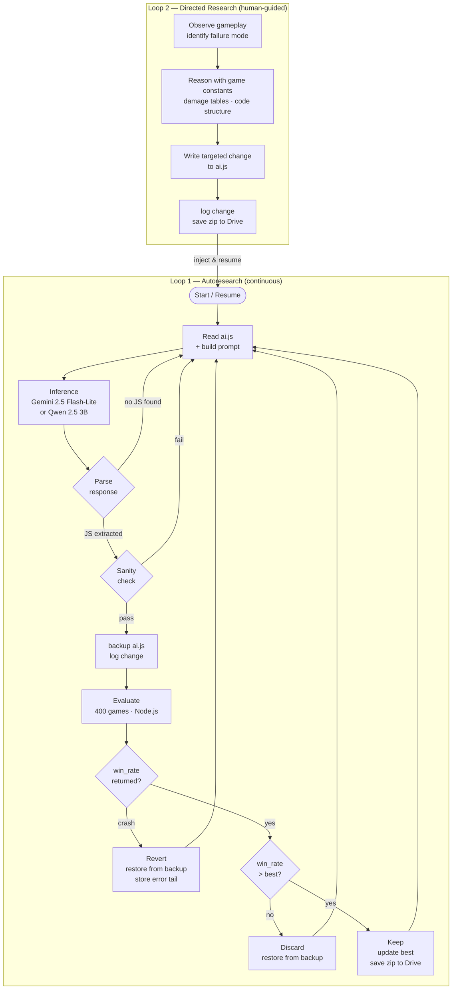

# Grid Combat Autoresearch

This directory contains the implementation and documentation for an autonomous research system designed to improve the AI of the strategic game **Grid Combat**.

## Overview

The Autoresearch project implements a "Generalised Two-Loop MCTS Pipeline" for optimizing game heuristics. It leverages Large Language Models (LLMs) to propose and evaluate changes to the AI logic, iteratively improving its performance without human intervention.

For full details on the project architecture, empirical results, and findings, please refer to the **[Autoresearch section in the main README.md](../README.md#autoresearch--autonomous-ai-improvement)**.

## Contents

-   **`GridCombat_Autoresearch.ipynb`**: The primary implementation of the research loop, designed to run in Google Colab. It handles the inference, evaluation, and persistence of the research experiments.
-   **`AUTORESEARCH.md`**: Documents the theoretical framework and the generalized two-loop architecture used by this system.
-   **`ai.js`**: The current best version of the Grid Combat AI heuristic.
-   **`baseline_ai.js`**: The baseline AI used for comparison during experiments.
-   **`evaluate.js`**: The Node.js-based evaluation script that measures the win rate of the candidate AI against the baseline across 400 games.
-   **`game_core.js`**: The core game logic and constants shared by the AI and the evaluator.

## Note on Notebook Display

> [!NOTE]
> The `GridCombat_Autoresearch.ipynb` file may not be displayed correctly by the GitHub Markdown viewer due to its size and format. For an accurate view of the notebook's content, including all instructions and results, please use the **RAW** mode or open it directly in Google Colab.

## Updated Notice

> Notice: The Sparsity Resolution research report has been moved to its own dedicated repository to better reflect its focus on inference-time compute and continuous latent gradient steering. Please see the full report at **[latent-reasoning-engine](https://github.com/bob-friedman/latent-reasoning-engine)**.
